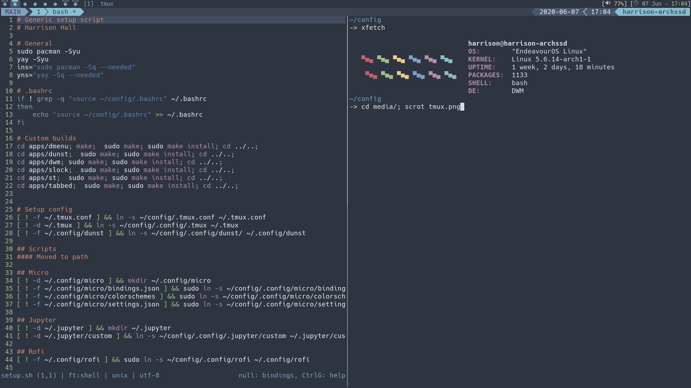
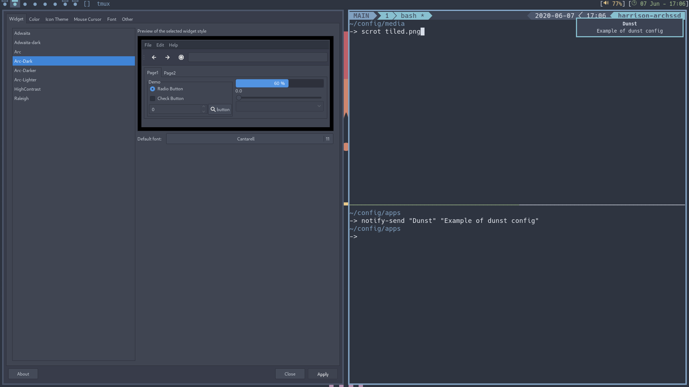
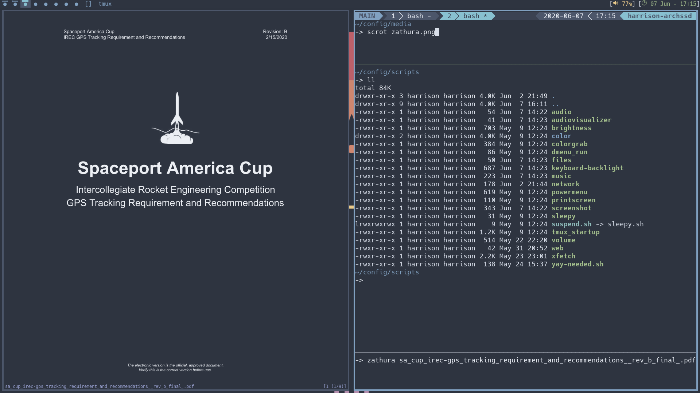

# config
`setup.sh` is designed for any variant of arch, I currently use
endeavouros. .dotfiles saved since I should only have to set something
up the first time. 

### Forks
Custom builds of certain programs utilizing only the patches I need. 
* dmenu
  * Minimal menu (new scripts use rofi)
* dwm
  * Minimal tiling window manager
* cava
  * Audio visualizer
* slock
  * Minimal lock screen
* simple terminal (st)
  * Minimal (simple) terminal
* tabbed
  * Minimal tabbing application

### .config
* dunst
  * Minimal notification program
* `.dwm`
  * dwm startup scripts
* emacs
  * Extensive text editor
* jupyter
  * programming notebooks
* micro
  * Minimal text editor
* rofi
  * Minimal application launcher
* tmux
  * Terminal multiplexer
* vim
  * Another text editor
* xsessions
  * Simple file to make dwm selectable from lightdm
* zathura
  * pdf viewer

### Scripts 
Minimal scripts utilizing rofi with being cross-platform in mind.
* audio
* audiovisualizer
* brightness
* colorgrab
* files
* lockscreen
* music
* network
* screenshot
* sleepy
* suspend
* volume

### Manual Setup
Things that I don't feel comfortable scripting yet.
* lxappearance set gtk, icons, font, etc.
* Set up ly
  * `systemctl disable lightdm`
  * `systemctl enable ly`
* Setup for `etc/fstab`
