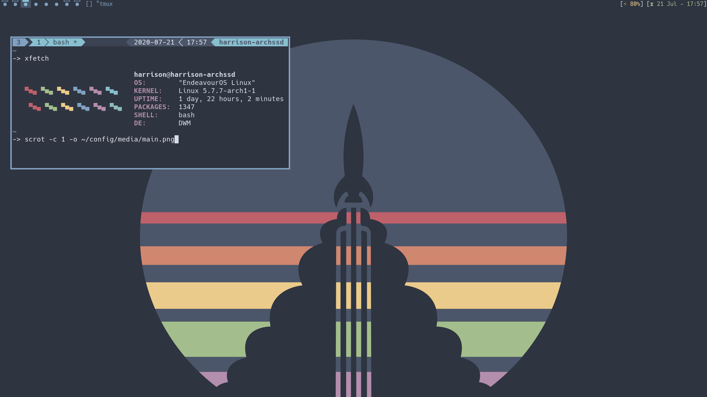

# config
`setup.sh` is designed for any variant of arch, I currently use
endeavouros. .dotfiles saved since I should only have to set something
up the first time. 




Most everything is nord-themed (I know, I'm basic). Old setup used to use
dracula, but I've enjoyed the minimalism that comes with nord. 

This repo provides both a simple way for me to set my system up
```bash
git clone https://github.com/harrisonhall/config
cd config
./setup.sh -a
```
and acts as a show-and-tell for my current configs. I would not recommend
copying it, but rather looking element-by-element and integrating my
changes into your own configs. If you would like to use this repo as-is, be
sure to edit `config.sh` and replace any instance of my name with yours or
any paths I forgot to generalize with an accurate one.

### Forks
Custom builds of certain programs utilizing only the patches I need. 
* dmenu
  * Minimal menu (new scripts use rofi)
* dwm
  * Minimal tiling window manager
* cava
  * Audio visualizer
* slock
  * Minimal lock screen
* simple terminal (st)
  * Minimal (simple) terminal
* tabbed
  * Minimal tabbing application

### .config
* dunst
  * Minimal notification program
* `.dwm`
  * dwm startup scripts
* emacs
  * Extensive text editor
* jupyter
  * programming notebooks
* micro
  * Minimal text editor
* rofi
  * Minimal application launcher
* tmux
  * Terminal multiplexer
* vim
  * Another text editor
* xsessions
  * Simple file to make dwm selectable from lightdm
* zathura
  * pdf viewer
  
### Scripts 
Minimal scripts utilizing rofi with being cross-platform in mind.
* audio
* audiovisualizer
* brightness
* colorgrab
* files
* lockscreen
* music
* network
* screenshot
* sleepy
* suspend
* volume

### Manual Setup
Things that I don't feel comfortable scripting yet.
* lxappearance set gtk, icons, font, etc.
* Set up ly
  * `systemctl disable lightdm`
  * `systemctl enable ly`
* Setup for `etc/fstab`
